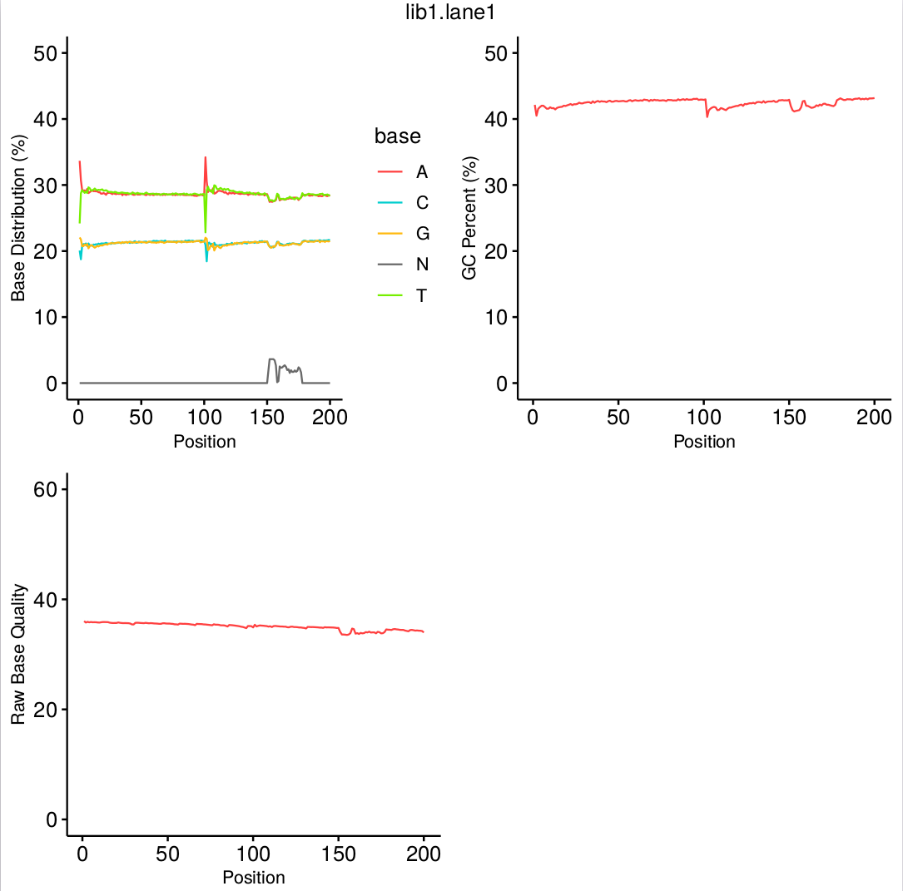

# Fast_Aligner

## Introduction
Large developemnt in Next Generation Sequencing (NGS) technology has enabled DNA sequencing data generating at ever faster speed and at very low cost, which underscores the demand for more efficient tools. Here, we provide **Fast_Aligner**, an efficient and reliable tool, which integrates the pipeline of 'Filteration->Alignment->Sort->Mark Duplicates'.

## Requirements
* htslib 1.9 or greater at [site](https://github.com/samtools/htslib).

## Quick Start Guide
* Build Fast_Aligner: `make`
* Build index for reference genome: `fast_aligner index hg19.fa`
* Align reads to reference: `fast_aligner align hg19.fa input_r1.fq.gz,input_r2.fq.gz`

## Running Fast_Aligner
* **`fast_aligner index`**
This module is designed for building reference index and preparing for the alignment. Besides the path of reference genome fasta file, the `-p` argument can be used to set the output prefix of index files.

* **`fast_aligner align`**
The command `align` integrates the pipeline of raw reads filteration, reads alignment, sorting alignments and marking PCR duplicates. Besides, this pipeline can be fine-tuned using `-e` argument, which will skip the step of raw reads filteration, and `-x` argument, which will skip the step of markng PCR duplicates.

&ensp;&ensp;&ensp;1. The simplest way to run this module is as follows. Fastq files of mate pairs should be inputted as one parameter and separated using `,`. Please do **not** add any blanks between the two fastq files. Output directory can be set using `-o` argument.
```
fast_aligner align -o out_dir hg19.fa input_r1.fq.gz,input_r2.fq.gz
```

&ensp;&ensp;&ensp;2. Adapter sequences or adapter list files can be added using `-b` argument. Like the fastq files, adapter sequences or adapter list files of mate paris should be inputted as one parameter and separated using `,`, without any blanks between them. Please enter the information of **forward** adapter first, then enter the information of **reverse** adapter.
```
fast_aligner align -o out_dir -b AAGTGACAA,AAGTGAGCCAAGGAGTTG  hg19.fa input_r1.fq.gz,input_r2.fq.gz
```

&ensp;&ensp;&ensp;3. Large sample sequencing data with multiple sequencing libraries or from multiple sequencing lanes can be processed using a `cfg` file.
```
fast_aligner align -o out_dir -i input.cfg hg19.fa
```
&ensp;&ensp;&ensp;Here is an example for `cfg` file.
```
[lib]
  name = 2900978423C
  [lane]
    name = DP800002044BL_L01
    fq1 = DP800002044BL_L01_9_1.fq.gz
    fq2 = DP800002044BL_L01_9_2.fq.gz
    ad1 = AAGTCGGAGGAGACAA
    ad2 = AAGTCGGATGAGCCAAGGAGTTG
  [lane]
    name = DP800002044BL_L02
    fq1 = DP800002044BL_L02_9_1.fq.gz
    fq2 = DP800002044BL_L02_9_2.fq.gz
    ad1 = adatper_1.list.gz
    ad2 = adatper_2.list.gz
    
[lib]
  name = 2900978421C
  [lane]
    name = DP800002047BL_L01
    fq1 = DP800002047BL_L01_11_1.fq.gz
    fq2 = DP800002047BL_L01_11_2.fq.gz
```

&ensp;&ensp;&ensp;4. Basic statistics of fastq files, which are shown below, are added to the results of `fast_aligner align`.

```
[2900978423C-DP800002044BL_L01]
  Number of total raw pes       = 806961
  Number of total clean pes     = 775849
  
  Number of pes with too many N = 29235
  Ratio of pes with too many N  = 3.62%
  
  Number of low quality pes     = 1
  Ratio of low quality pes      = 0.00%
  
  Number of pes with adapter    = 1876
  Ratio of pes with adapter     = 0.23%
  
  Number of total filtered pes  = 31112
  Ratio of total filtered pes   = 3.86%
```

* **`fast_aligner fq_qc`**
This command is designed for calculating substantial statistical data of Fastq files. When something wrong happens in `fast_aligner align`, `fast_alginer fq_qc` can help find out what is wrong in the input Fastq files. As shown in the picture below, the results of this command are statistical charts of **base distribution**, **gc**, and **base quality**.



## Release
* **`Version 2.2.0`**  
&ensp;&ensp;&ensp; 1. Parameter `-H` and `-R` were added to command `align`. The usage of the two paramters were same as their usage in `bwa mem`.  
&ensp;&ensp;&ensp; 2. Read Group IDs were added to all read records to facilitate downstream analyses, for example, GATK HaplotypeCaller.  
&ensp;&ensp;&ensp; 3. Basic statistics of filtered reads was added to the results of `fast_aligner align`.  
&ensp;&ensp;&ensp; 4. New command `fq_qc` was added for the statistics of **base distribution**, **GC**, and **base quality**.  
